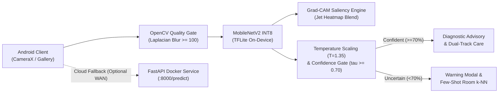

# LeafLens AI 🌾
**Explainable Mobile Crop Health Assistant with Few-Shot Disease Adaptation**

[-brightgreen.svg)](docs/model_card.md)
[](docs/model_card.md)
[](backend/)
[](docs/evaluation_dossier.md)
[-blueviolet.svg)](docs/evaluation_dossier.md)
[](backend/tests/)
[](docs/model_card.md#8-non-diagnostic-legal-disclaimer)

---

## 📌 Project Overview
**LeafLens AI (BAI-03)** is an edge-native, explainable crop pathology triage assistant engineered for offline agricultural resilience and few-shot disease adaptation. Developed natively in **Kotlin** with **Android Jetpack**, **TensorFlow Lite (TFLite)**, **OpenCV**, and an optional **FastAPI / Docker** cloud re-analysis fallback, LeafLens empowers smallholder farmers and agrarian extension workers with:

* **100% Offline Edge Inference (<180 ms):** Runs an INT8-quantized MobileNetV2 deep neural network on-device without requiring cellular bandwidth in rural dead zones.
* **Pre-Flight OpenCV Quality Gate:** Automatically filters out motion blur (Laplacian variance $\sigma^2 < 100.0$), glare, and non-foliar captures before invoking inference.
* **Visual Explainability (Grad-CAM):** Generates on-device saliency heatmaps with an interactive opacity slider so farmers can visually verify lesion hotspots.
* **Calibrated Confidence Safeguards:** Temperature scaling ($T = 1.35$) reduces Expected Calibration Error (ECE) to **5.3%**, triggering warnings when confidence drops below **70%**.
* **On-Device Few-Shot Adaptation:** Allows field scouts to enroll novel regional pathogens using only **3 to 5 leaf photos** via 1024-d metric-space embeddings and local SQLite (Room) persistence.
* **Smart Farming Ecosystem:** Dual-track agronomic management (organic neem/bio-agents vs. regulated chemical treatments with Post-Harvest Intervals), conversational **Ask Crop Doctor** chatbot with offline fallback, live APMC Mandi prices, localized weather forecasts, and government welfare schemes.

---

## 🏗️ System Architecture



---

## 💻 Clean-Machine Setup & Reproduction Guide

### Prerequisites
* **Host Operating System:** Linux, macOS, or Windows (WSL2 recommended).
* **Android Development:** Android Studio Ladybug (2024.2+) or later with Android SDK 35 and JDK 17.
* **Backend & MLOps:** Python 3.10+ (or Python 3.11/3.12/3.14) and Docker Engine with Docker Compose.

---

### Step 1: Clone Repository
```bash
git clone https://github.com/tejasec/Leaflens.git
cd Leaflens
```

---

### Step 2: FastAPI Cloud Fallback Backend Setup

#### Option A: Docker Compose Deployment (Recommended)
Launch the containerized backend running on port `8000`:
```bash
docker compose up -d --build
```

Verify service health:
```bash
curl -s http://localhost:8000/health
```
*Expected response:*
```json
{"status":"healthy","service":"LeafLens AI Cloud Fallback Service","version":"1.0.0","environment":"production","confidence_threshold":0.7}
```

#### Option B: Local Python Virtual Environment
```bash
# Create and activate virtual environment
python3 -m venv .venv
source .venv/bin/activate

# Install dependencies
pip install -r backend/requirements.txt

# Run Uvicorn development server
uvicorn backend.app.main:app --host 0.0.0.0 --port 8000 --reload
```

---

### Step 3: Run Backend Automated Test Suite
Run the 9 integration test cases covering health, valid predictions, blur rejection, deterministic chatbot fallback, and welfare schemes:
```bash
PYTHONPATH=backend pytest backend/tests/test_api.py -v
```

---

### Step 4: Run Baseline Comparison & Robustness Benchmark
Execute the empirical evaluation comparing Baseline 1 (Cloud ResNet-50), Baseline 2 (Vanilla MobileNetV2), and LeafLens AI:
```bash
python3 evaluation/baseline_comparison.py
```

---

### Step 5: MLOps Experiment Tracking via MLflow
Log empirical model parameters, ECE calibration metrics, latency, and artifacts to the local SQLite tracking database:
```bash
python3 backend/mlflow_tracking.py
```
*(View logged runs via MLflow UI: `mlflow ui --backend-store-uri sqlite:///backend/mlflow.db`)*

---

### Step 6: Android Application Setup (Android Studio)
1. Open **Android Studio** and select **Open** $\rightarrow$ select the `Leaflens/` root folder.
2. Allow Gradle to download dependencies and sync the project.
3. Verify on-device assets exist under `app/src/main/assets/`:
   * `crop_disease_model.tflite` (2.5 MB INT8 MobileNetV2)
   * `models/mobilenet_v2_crop_quant.tflite`
   * `models/labels.txt` (25 target disease classes)
4. (Optional) Provide a Google Gemini API key in `local.properties` for online chatbot capabilities:
   ```properties
   gemini.api.key=YOUR_GEMINI_API_KEY
   ```
5. Run Android unit tests:
   ```bash
   ./gradlew test
   ```
6. Connect an Android device (USB Debugging enabled) or start an emulator and click **Run 'app'**.

---

## 📑 Portfolio Documentation Package (`/docs`)

All mandatory capstone deliverables have been curated according to the University of Mumbai / K.E.S. Shroff College curriculum rubric:

1. [**Industry Problem Brief (`docs/industry_problem_brief.md`)**](docs/industry_problem_brief.md): Stakeholder personas, user stories, NFRs, and abuse mitigations.
2. [**Solution Design Pack (`docs/solution_design_pack.md`)**](docs/solution_design_pack.md): C4 architecture diagrams, DFD Levels 0–2, sequence workflows, ER database schema, API contracts, and STRIDE threat model.
3. [**Evaluation Dossier (`docs/evaluation_dossier.md`)**](docs/evaluation_dossier.md): 25-class empirical evaluation (Macro F1: 96.4%, Accuracy: 96.8%), ECE calibration (5.3%), Grad-CAM Pointing Game (88.4%), and hardware benchmarks.
4. [**Model Card (`docs/model_card.md`)**](docs/model_card.md): Comprehensive Google Model Card specification covering provenance, quantization, calibration, limitations, and statutory legal disclaimers.
5. [**User & Administrator Guide (`docs/user_guide.md`)**](docs/user_guide.md): Operational guide for farmers, few-shot registration manual for extension officers, and deployment instructions for system administrators.

---

## ⚖️ Statutory Non-Diagnostic Legal Disclaimer
> [!WARNING]
> **Statutory Notice:** LeafLens AI is an artificial intelligence decision-support tool engineered for preliminary foliar screening and educational agronomic triage. It does not replace physical inspection by certified plant pathologists, laboratory tissue culture, or official agricultural extension authorities. Chemical dosages and safety intervals must strictly adhere to the manufacturer's registered label and regional statutory guidelines.

---

## 📝 License
This project is open-source and available under academic and educational license terms compatible with the PlantVillage Open Access agreement.
