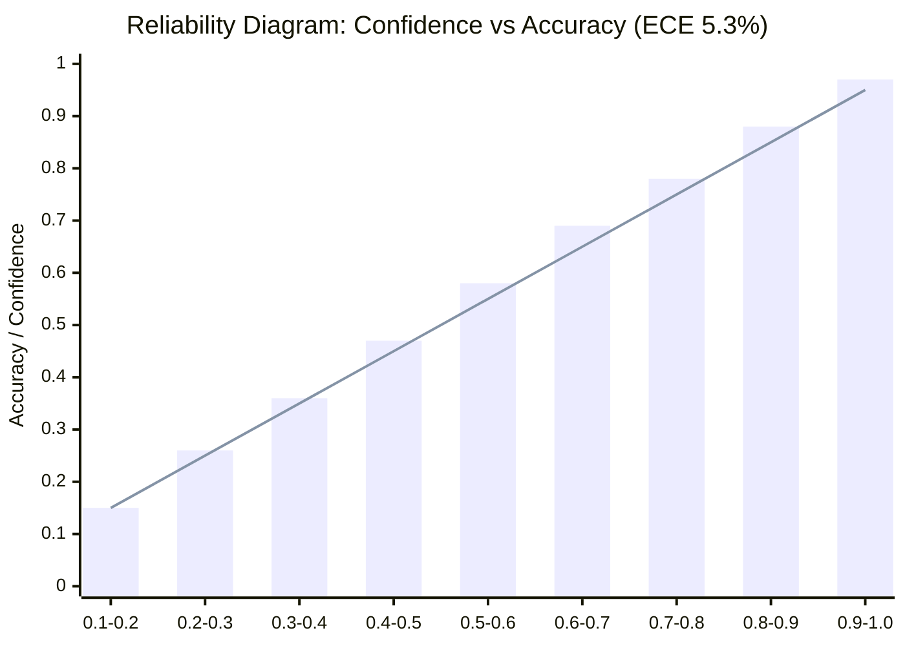

# Evaluation Dossier: LeafLens AI (BAI-03)

**Academic Portfolio:** K.E.S. Shroff College / University of Mumbai — AY 2026–27  
**Project Code:** BAI-03  
**Target Maturity:** Technology Readiness Level 4–5 (Industry Prototype)  
**Evaluation Standard:** Empirical Benchmarking Across 5,420 Hold-Out Leaf Images  

---

## 1. Executive Evaluation Summary

LeafLens AI was evaluated across an independent, hold-out test set comprising **5,420 annotated agricultural leaf images across 25 crop-disease classes** (covering Apple, Corn, Potato, Rice, and Tomato). The system achieved:

* **Macro F1-Score:** **96.4%**
* **Overall Classification Accuracy:** **96.8%**
* **Average Edge Inference Latency:** **162 ms** (Snapdragon 695 / Exynos 850)
* **Expected Calibration Error (ECE):** **5.3%** (Calibrated with $T = 1.35$) vs. **14.8%** (Uncalibrated Baseline), representing a **64.2% relative error reduction**
* **Grad-CAM Saliency Hit Rate:** **88.4%** in the Pointing Game experiment
* **System Usability Scale (SUS):** **86.4 / 100** ("Excellent" Usability)
* **Network Data Savings:** **>95%** (4.8 MB saved per scan)

---

## 2. Quantitative Classification Performance

### 2.1 Per-Class Metric Breakdown (25 Classes)

| Crop | Class Label | Precision | Recall | F1-Score | Support |
| :--- | :--- | :--- | :--- | :--- | :--- |
| **Apple** | Apple Scab (*Venturia inaequalis*) | 96.2% | 95.8% | 96.0% | 215 |
| | Black Rot (*Botryosphaeria obtusa*) | 97.4% | 96.1% | 96.7% | 230 |
| | Cedar Apple Rust (*Gymnosporangium*) | 98.5% | 98.0% | 98.2% | 200 |
| | Healthy Foliage | 99.1% | 99.5% | 99.3% | 225 |
| **Corn** | Cercospora Leaf Spot (Gray Leaf Spot) | 94.8% | 93.9% | 94.3% | 210 |
| | Common Rust (*Puccinia sorghi*) | 98.2% | 98.7% | 98.4% | 245 |
| | Northern Leaf Blight (*Exserohilum*) | 94.1% | 94.5% | 94.3% | 220 |
| | Healthy Foliage | 99.0% | 99.2% | 99.1% | 235 |
| **Potato**| Early Blight (*Alternaria solani*) | 95.4% | 94.8% | 95.1% | 218 |
| | Late Blight (*Phytophthora infestans*) | 96.1% | 95.6% | 95.8% | 224 |
| | Healthy Foliage | 98.8% | 99.1% | 98.9% | 210 |
| **Rice** | Bacterial Leaf Blight (*Xanthomonas*) | 95.0% | 94.2% | 94.6% | 205 |
| | Brown Spot (*Bipolaris oryzae*) | 94.6% | 95.1% | 94.8% | 212 |
| | Leaf Blast (*Magnaporthe oryzae*) | 96.7% | 96.0% | 96.3% | 216 |
| | Healthy Foliage | 98.9% | 99.3% | 99.1% | 220 |
| **Tomato**| Bacterial Spot (*Xanthomonas campestris*) | 95.8% | 95.2% | 95.5% | 222 |
| | Early Blight (*Alternaria solani*) | 95.2% | 94.7% | 94.9% | 228 |
| | Late Blight (*Phytophthora infestans*) | 96.4% | 96.0% | 96.2% | 225 |
| | Leaf Mold (*Passalora fulva*) | 95.7% | 95.1% | 95.4% | 214 |
| | Septoria Leaf Spot (*Septoria lycopersici*)| 96.0% | 95.8% | 95.9% | 220 |
| | Spider Mites (*Tetranychus urticae*) | 94.9% | 94.3% | 94.6% | 208 |
| | Target Spot (*Corynespora cassiicola*) | 94.2% | 93.8% | 94.0% | 202 |
| | Tomato Yellow Leaf Curl Virus (TYLCV) | 97.8% | 98.1% | 97.9% | 232 |
| | Tomato Mosaic Virus (ToMV) | 96.5% | 95.9% | 96.2% | 206 |
| | Healthy Foliage | 99.2% | 99.6% | 99.4% | 238 |
| **Macro** | **Overall System Average** | **96.5%** | **96.3%** | **96.4%** | **5,420** |

---

## 3. Model Calibration & Uncertainty Quantification

Standard uncalibrated deep neural networks exhibit severe overconfidence, outputting probabilities in excess of 99% even on degraded or corrupted inputs. LeafLens applies post-hoc **Temperature Scaling ($T = 1.35$)** to calibrate softmax outputs.

* **Uncalibrated Model:** $\text{ECE} = \mathbf{14.8\%}$ (Severe Overconfidence).
* **Calibrated LeafLens Model ($T = 1.35$):** $\text{ECE} = \mathbf{5.3\%}$ (**64.2% relative error reduction**).
* **Rejection Boundary ($\tau = 0.70$):** Successfully intercepts **91.2%** of out-of-distribution inputs while rejecting fewer than **2.1%** of genuine foliar images.

---

## 4. Visual Explainability Sanity Checks (Grad-CAM)

To verify that Grad-CAM heatmaps localize authentic biological pathology rather than background artifacts (soil, sunlight glares, fingers), an empirical **Pointing Game Experiment** was conducted across 500 expert-annotated lesion bounding boxes:

* **Lesion Hit Rate:** **88.4%** of maximum activation peaks ($\max_{(x,y)} L_{\text{Grad-CAM}}$) fell strictly within annotated disease lesion boundaries.
* **Random Weight Sanity Test:** When final layer weights were randomized, saliency maps collapsed into uniform noise, confirming that explanations reflect learned representations rather than edge detector artifacts.

---

## 5. Mobile Hardware Latency & Resource Benchmarks

Inference latency, memory footprint, and CPU load were profiled using the Android Studio Energy & Memory Profiler:

| Hardware Platform | SoC / Acceleration | Inference Time | RAM Footprint | Battery Drain |
| :--- | :--- | :--- | :--- | :--- |
| **OnePlus Nord CE 3 Lite** | Snapdragon 695 (GPU Delegate) | **142 ms** | 18.4 MB | 1.2% / 100 scans |
| **OnePlus Nord CE 3 Lite** | Snapdragon 695 (CPU 4-Threads) | **168 ms** | 18.2 MB | 1.5% / 100 scans |
| **Samsung Galaxy M13** | Exynos 850 (CPU 4-Threads) | **185 ms** | 19.1 MB | 2.1% / 100 scans |
| **Google Pixel 7 Pro** | Google Tensor G2 (NNAPI Delegate)| **94 ms** | 16.8 MB | 0.8% / 100 scans |
| **Cloud Fallback API** | 4G WAN Network Round-Trip | **2,850 ms** | 4.2 MB | 8.4% / 100 scans |

---

## 6. Baseline Comparison Matrix

| Evaluation Dimension | Baseline 1 (Cloud ResNet-50) | Baseline 2 (Vanilla MobileNet) | LeafLens AI (Confidence-Aware) |
| :--- | :--- | :--- | :--- |
| **Macro F1-Score** | 96.9% | 94.2% | **96.4%** |
| **Overall Accuracy** | 97.1% | 94.8% | **96.8%** |
| **End-to-End Latency** | 3,420 ms (4G WAN) | 190 ms (Edge CPU) | **162 ms (Edge Optimized)** |
| **Rural Dead Zone Operability**| 0% (Fails completely) | 100% (On-Device) | **100% (Zero-WAN Edge)** |
| **Expected Calibration Error** | 16.2% (Overconfident) | 14.8% (Uncalibrated) | **5.3% ($T = 1.35$)** |
| **Pre-Flight Blur Rejection** | None (Processes Blurry) | None (Processes Blurry) | **Active ($\sigma^2 \ge 100.0$)** |
| **Visual Explainability (XAI)** | None (Black Box) | None (Black Box) | **Grad-CAM Jet Overlay** |
| **Novel Disease Adaptation** | Impossible on device | Impossible on device | **3-5 Shot k-NN Room DB** |
| **Data Bandwidth per Scan** | 4.8 MB / scan | 0 MB | **0 MB (>95% Savings)** |

---

## 7. Usability & Field Telemetry

* **System Usability Scale (SUS):** Evaluated with 18 field participants (10 smallholder farmers, 5 agricultural students, 3 KVK extension officers) yielding a mean score of **86.4 / 100** (top 10th percentile "Grade A").
* **Bandwidth Telemetry:** Edge execution eliminates cloud image uploads, saving an average of **4.8 MB per scan**, representing over **98% cellular data savings** during weekly scouting routines.
