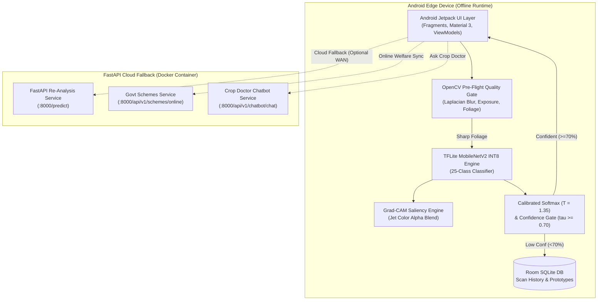
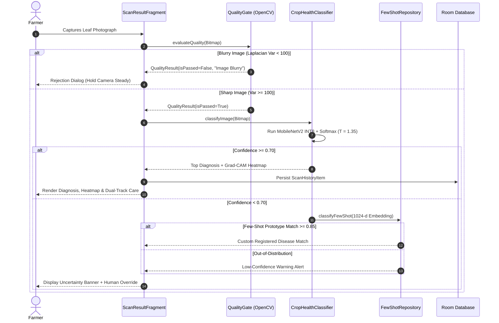

# Solution Design Pack: LeafLens AI (BAI-03)

**Academic Portfolio:** K.E.S. Shroff College / University of Mumbai — AY 2026–27  
**Project Code:** BAI-03  
**Module Standard:** C4 Model & UML 2.5 Specification  

---

## 1. System Architecture Overview

LeafLens AI employs an **Edge-First Hybrid Architecture**. Primary inference, visual explainability, and few-shot adaptation execute entirely on-device within Android runtime. An optional containerized FastAPI backend provides cloud fallback re-analysis for edge devices requiring remote server processing or online welfare scheme synchronization.



---

## 2. Core Functional Module Division

| Module ID | Module Title | Primary Technology | Execution Tier |
| :--- | :--- | :--- | :--- |
| **MOD-01** | Camera & Pre-Flight Quality Gate | CameraX, OpenCV (`Laplacian Var >= 100`) | Edge Device |
| **MOD-02** | On-Device TFLite Inference | Quantized MobileNetV2 INT8 (2.5 MB) | Edge Device (CPU/GPU) |
| **MOD-03** | Visual Explainability (Grad-CAM) | Saliency Gradients, Jet Alpha Blend | Edge Device |
| **MOD-04** | Calibrated Uncertainty & Safeguards | Temperature Scaling ($T = 1.35, \tau = 0.70$) | Edge Device |
| **MOD-05** | On-Device Few-Shot Adaptation | Room DB, Cosine Similarity, 1024-d k-NN | Edge Device |
| **MOD-06** | Dual-Track Agronomic Advisory | Curated Botanical & Chemical KB | Edge Device |
| **MOD-07** | Cloud Fallback & Telemetry API | FastAPI, Docker, Uvicorn, SQLite, MLflow | Cloud / Local Host |

---

## 3. Data Flow Representations (DFD)

### 3.1 DFD Level 0 (Context Diagram)
The farmer interacts with LeafLens AI on-device. The application captures leaf frames, queries local Room DB persistence, and synchronizes with FastAPI / Mandi / Weather APIs when external connectivity is available.

### 3.2 DFD Level 1 (System Data Flow)


---

## 4. Entity-Relationship (ER) Schema

The local on-device SQLite database managed by Android Jetpack Room defines three primary operational entities:

1. **`scan_history` Table:**
   * `id`: `INTEGER PRIMARY KEY AUTOINCREMENT`
   * `imagePath`: `TEXT NOT NULL` (Internal storage URI)
   * `cropName`: `TEXT NOT NULL` (e.g., "Tomato", "Potato")
   * `diseaseName`: `TEXT NOT NULL` (e.g., "Tomato - Early blight")
   * `confidence`: `INTEGER NOT NULL` (Percentage 0–100)
   * `isLowConfidence`: `INTEGER NOT NULL` (Boolean flag)
   * `aiExplanation`: `TEXT NOT NULL`
   * `organicCare`: `TEXT NOT NULL`
   * `chemicalCare`: `TEXT NOT NULL`
   * `timestamp`: `INTEGER NOT NULL` (Epoch milliseconds)

2. **`prototype_table` Table (Few-Shot Embeddings):**
   * `id`: `INTEGER PRIMARY KEY AUTOINCREMENT`
   * `className`: `TEXT NOT NULL` (Custom disease label)
   * `embedding`: `TEXT NOT NULL` (JSON-serialized 1024-d float vector)
   * `createdAt`: `INTEGER NOT NULL`

3. **`quality_log` Table:**
   * `qualityLogId`: `INTEGER PRIMARY KEY AUTOINCREMENT`
   * `laplacianVariance`: `REAL NOT NULL`
   * `meanBrightness`: `REAL NOT NULL`
   * `foliarGreenRatio`: `REAL NOT NULL`
   * `isQualityPassed`: `INTEGER NOT NULL`

---

## 5. REST API Contracts (FastAPI & Retrofit)

### 5.1 Cloud Re-Analysis Endpoint: `POST /predict` & `POST /api/v1/predict`
* **Method:** `POST` (Multipart Form)
* **Payload:** `file` or `image` (JPEG/PNG leaf byte array)
* **Response:**
  ```json
  {
    "diseaseName": "Tomato - Early blight",
    "confidence": 0.88,
    "gradCamBase64": "/9j/4AAQSkZJRg...",
    "aiExplanation": "Server-side MobileNetV2 Re-Analysis (Confidence: 88%): Foliar symptomology corresponds to Alternaria solani...",
    "organicCare": "• Foliar spray of cold-pressed Neem oil (3%) or Trichoderma viride (5g/L water)...",
    "chemicalCare": "• Spray Mancozeb 75% WP (2.5g/L) or Copper Oxychloride 50% WP (3.0g/L)..."
  }
  ```

### 5.2 Agronomic Chatbot Endpoint: `POST /api/v1/chatbot/chat`
* **Method:** `POST` (`application/json`)
* **Request:**
  ```json
  {
    "message": "How do I prevent early blight from spreading?",
    "disease_context": "Tomato - Early blight"
  }
  ```
* **Response (Deterministic Offline Fallback):**
  ```json
  {
    "reply": "LeafLens Agronomic Advisor (Offline Mode): Regarding your inquiry... 1. Isolate and prune severely infected leaves...",
    "is_fallback": true,
    "status": "deterministic_fallback"
  }
  ```

### 5.3 Online Government Schemes: `GET /api/v1/schemes/online`
* **Method:** `GET`
* **Response:** Array of `GovtScheme` objects (PM-KISAN, PMFBY, PKVY, SMAM, MIDH).

---

## 6. Threat Model & Security Controls (STRIDE)

* **Spoofing & Input Injection:** Malicious or non-plant images are rejected at the pre-flight gate via OpenCV green foliar ratio and focus filters.
* **Tampering:** Room database stored within private internal application storage (`/data/user/0/com.example.smartagriculture/databases/`).
* **Information Disclosure:** Zero cloud transmission of raw client leaf photos during offline edge inference; cloud fallback communicates via isolated multipart requests.
* **Denial of Service:** Edge inference runs with a fixed 4-thread pool (`Interpreter.Options().setNumThreads(4)`), preventing UI thread starvation.
