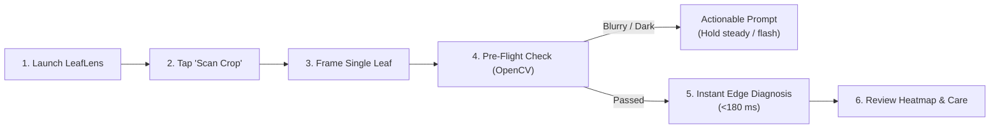

# User & Administrator Guide: LeafLens AI (BAI-03)

**Academic Portfolio:** K.E.S. Shroff College / University of Mumbai — AY 2026–27  
**Project Code:** BAI-03  
**Target Audience:** Smallholder Farmers, Agricultural Extension Officers, and System Administrators  

---

## Part 1: Farmer & Field Scout User Guide

### 1.1 Getting Started & Hardware Requirements
* **Operating System:** Android 8.0 (API Level 26) or higher.
* **Hardware:** Minimum 2 GB RAM (4 GB recommended for optimum latency), Camera with autofocus.
* **Connectivity:** **100% Offline Capable**. No cellular data or Wi-Fi is required for on-device diagnosis.

---

### 1.2 Step-by-Step Foliar Disease Scanning Workflow



1. **Open the Camera:** From the dashboard, tap the **"Scan Crop"** button or select an image from your device gallery.
2. **Align the Leaf:** Position a single diseased leaf within the viewfinder bounding box. Ensure natural, even sunlight and hold the camera approximately 10–15 cm from the leaf surface.
3. **Pre-Flight Quality Gate Feedback:**
   * **"Image is Blurry":** If the camera moved or the focus was lost ($\text{Laplacian Var} < 100.0$), the app prompts you to hold the phone steady and tap to refocus.
   * **"Image is Underexposed":** If lighting is too dark ($\text{Brightness} < 40.0$), the app prompts you to enable flash or step into daylight.
   * **"No Foliage Detected":** If the frame is filled by soil or concrete, the app prompts you to center the leaf blade.
4. **Instant Edge Diagnosis:** Within **140–185 ms**, the screen transitions to the **Scan Result** screen.

---

### 1.3 Interpreting Diagnostic Results & Visual Explanations

1. **Disease Identification:** Displays the common name (e.g., *"Tomato - Early blight"*), scientific name (*Alternaria solani*), and calibrated confidence percentage.
2. **Interactive Grad-CAM Heatmap:** 
   * A dynamic color overlay spotlights the pathological features that triggered the diagnosis.
   * **Red/Orange Zones:** Indicate active necrotic fungal spots or chlorotic halos.
   * **Blue/Green Zones:** Represent healthy leaf tissue ignored by the model.
   * **Opacity Slider:** Drag the slider to fade between the raw photograph and the heatmap overlay to visually verify the lesion boundaries.
3. **Confidence Warnings & Responsible AI Guardrails:**
   * If confidence drops below **70%**, a yellow warning banner states: *"Uncertain Diagnosis — Potential Out-of-Distribution Foliage."*
   * You can tap **"Human Override"** to log the case or request senior agronomist review.
4. **Dual-Track Agronomic Management:**
   * **Organic Care (Green Tab):** Prioritizes botanical extracts (3% cold-pressed neem oil), bio-fungicides (*Trichoderma viride*, *Bacillus subtilis*), and cultural practices (pruning lower leaves, improving airflow).
   * **Chemical Treatment (Orange Tab):** Details regulatory fungicides (Mancozeb 75% WP @ 2.5g/L), dilution ratios, **Post-Harvest Intervals (PHI: 7 days)**, and worker re-entry intervals (REI: 24 hours).
5. **Ask Crop Doctor AI Chatbot:**
   * Tap **"Ask Crop Doctor"** to open a conversational assistant.
   * Ask follow-up questions (e.g., *"Can I spray if rain is expected tomorrow?"*).
   * If offline, the app delivers deterministic, agronomic safety guidance.
6. **Case History & PDF Export:**
   * All scans are automatically saved to local Room DB.
   * Tap **"Export PDF"** to create an agronomic audit dossier to show local agricultural extension agents or fertilizer retailers.

---

## Part 2: Extension Officer Operations: Few-Shot Disease Adaptation

In the event of an emerging regional pathogen not included in the pre-trained 25 classes:

1. Navigate to **Dashboard $\rightarrow$ Settings $\rightarrow$ Register New Crop Disease**.
2. Capture **3 to 5 clear photographs** ("shots") of the novel leaf disease from different angles.
3. Enter the disease label (e.g., *"Okra Yellow Vein Mosaic"*).
4. The system extracts 1024-dimensional deep feature embeddings from MobileNetV2's penultimate layer and stores them in the on-device SQLite database.
5. Future scans exhibiting cosine similarity $\ge 0.85$ will immediately trigger your custom registered diagnosis without requiring model retraining.

---

## Part 3: Administrator & Developer Guide

### 3.1 Docker Compose Deployment (FastAPI Cloud Fallback)
The FastAPI cloud fallback container provides optional server-side re-analysis and online welfare scheme sync.

#### 1. Quick Start via Docker Compose:
```bash
# Build and launch the container
docker compose up -d --build

# Verify container health
curl -s http://localhost:8000/health
```

#### 2. Expected Output:
```json
{
  "status": "healthy",
  "service": "LeafLens AI Cloud Fallback Service",
  "version": "1.0.0",
  "environment": "production",
  "confidence_threshold": 0.7
}
```

#### 3. Environment Variables:
* `ENVIRONMENT`: Deployment tier (`production` / `development`).
* `CONFIDENCE_THRESHOLD`: Server rejection cutoff (default: `0.70`).
* `GEMINI_API_KEY`: *(Optional)* Google Gemini AI API key for dynamic chatbot responses. If omitted, deterministic agronomic fallback is served automatically.

---

### 3.2 Running the Backend Pytest Test Suite
To verify API contracts and schema adherence:

```bash
# Execute integration tests
PYTHONPATH=backend pytest backend/tests/test_api.py -v
```

---

### 3.3 Running Baseline Comparison & Calibration Benchmark
To reproduce the Black Book empirical calibration and robustness experiments:

```bash
python3 evaluation/baseline_comparison.py
```

---

### 3.4 MLOps Telemetry & MLflow Tracking
To log active model benchmarks into the local SQLite MLflow tracking backend:

```bash
python3 backend/mlflow_tracking.py
```

---

### 3.5 Android Client Compilation (Android Studio)
1. Open the project root in **Android Studio Ladybug (2024.2+)** or later.
2. Ensure Android SDK 35 and JDK 17 are selected.
3. Sync Gradle and build the debug APK:
   ```bash
   ./gradlew assembleDebug
   ```
4. Run Android local unit tests:
   ```bash
   ./gradlew test
   ```

---

## 4. Statutory Non-Diagnostic Legal Disclaimer
> [!WARNING]
> **Statutory Notice:** LeafLens AI is an artificial intelligence decision-support tool engineered for preliminary foliar screening and educational agronomic triage. It does not replace physical inspection by certified plant pathologists, laboratory tissue culture, or official agricultural extension authorities. Chemical dosages and safety intervals must strictly adhere to the manufacturer's registered label and regional statutory guidelines.
